# TuRest

## Grupo nro 1

### Elevator's pitch

Para el administrador de un local de comida, quien necesita la gestión sistemática y brindar un servicio digital a sus clientes, TuRest es una app web que gestiona atención y experiencia del cliente para el nuevo contexto. A diferencia de otras aplicaciones gastronómicas, nuestro producto le dará fidelización de clientes, menúes accesibles para diversos comensales y autonomía en la gestión del servicio. Y en resumen una transformación digital.

<!-- TOC -->
[toc]
<!-- /TOC -->

## Sprint 0

En esta instancia deberán:

- Contar con el entorno instalado y configurado para todo el equipo
- Disponer de todas las herramientas necesarias para la gestión del proyecto.
- Entregar el link a un documento README con todos los links del proyecto. El mismo deberá contener:
  - Tablero con el Backlog general
  - Documento de reporte
  - Repositorio
  - Url del producto

## Sprint 1

En esta instancia deberán:

- Definir un MVP
- Entregar un storyMapping con las funcionalidades del MVP
- Armar el backlog del MVP en la herramienta elegida (y configurada en el sprint anterior)

## Sprint 2

**Scrum master:** Mariano Álvarez

### Planning

### Daily

- Si.
- 1 vez x semana.

### Refinamiento

No se realizaron accionesn de refinamiento.

### Review

Cantidad Story Points quemados: 0
No se realizaron tareas de desarrollo.

### Retrospective

No se realizó.

### Calidad

No se realizaron acciones.

## Sprint 3

**Scrum master:** Leandro Malsam

### Planning

- Cantidad de story points comprometidos en el sprint: **7 SP**

### Daily

- A través de WhatsApp a diario.
- A través de Google Meet al menos 2 veces por semana.

### Refinamiento

N/A

### Review

- Cantidad Story Points quemados: **7 SP**

### Retrospective

Sprints 1 a 3.

- Inicialmente se demoró la selección de las herramientas de gestión, pero una vez definidas, la organización mejoró notablemente.
- Falta de seniority en el uso de las tecnologías. Se deberá seguir investigando y capacitando al equipo.
- Las planificaciones no se realizaron al comienzo de cada sprint, sino con cierta demora, lo que implicó que sobre los días finales haya que apresurar las tareas aumentando la carga de trabajo. Se deberá realizar la planificación temprana al comienzo del sprint.

### Calidad

- No se realizaron acciones.

## Sprint 4

**Scrum master:** Pablo Oronó

### Planning

- Cantidad de story points comprometidos en el sprint: **11 SP**

### Daily

- A través de WhatsApp a diario.
- A través de Google Meet al menos 2 veces por semana.

### Refinamiento

N/A

### Review

- Cantidad Story Points quemados: **11 SP**

### Retrospective

Sprints 4.

- Con los ambientes correctamente instalados y las herramientas de trabajo definidas, trabajamos mucho mas fluidos en este Sprint
- Seguimos avanzando con el aprendizaje de las herramientas durante el sprint
- Las planificaciones fueron realizadas en el día 0 del Sprint y esto nos ayudo en nuestra organización. Vamos a seguir con esta dinamica
- Falta profundizar en tests. En sprint nro 5 vamos a realizar test para el back-end la US de "alta de mozo".

### Calidad

- No se realizaron acciones.

## Sprint 5

**Scrum master:** Mailin Soñez

### Planning

- Cantidad de story points comprometidos en el sprint: **19 SP**

### Daily

- A través de WhatsApp a diario.
- A través de Google Meet al menos 2 veces por semana.

### Refinamiento

- Se realizó antes de la planning
- A partir de esta reunión surgió la necesidad de  crear 3 user stories nuevas
- Estas se agregaron al sprint actual

### Review

- Cantidad Story Points quemados: **19 SP**

### Retrospective

- No se realizaron acciones.

### Calidad

- Se investigó sobre el uso de actions, tests y otras tareas para integración continua
- Configuramos Lint en nuestro proyecto

## Sprint 6

**Scrum master:** Mailin Soñez

### Planning

- Cantidad de story points comprometidos en el sprint: **39 SP**

### Daily

- A través de WhatsApp a diario.
- A través de Google Meet al menos 2 veces por semana.

### Refinamiento

- Se realizó antes de la planning
- A partir de esta reunión surgió la necesidad de  crear 2 user stories nuevas
- Estas se agregaron al sprint actual

### Review

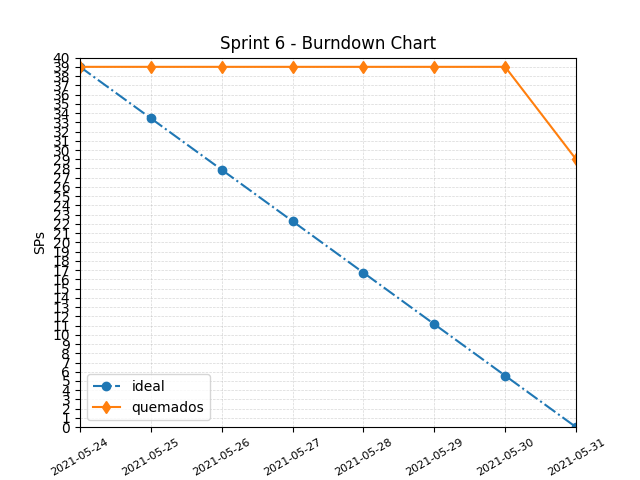

- Cantidad Story Points quemados: **10 SP**

### Retrospective

- Realizamos una actividad basada en 3 preguntas disparadoras para ver la visión personal de cada integrante del grupo y conversar luego sobre lo que surgió.
- Usamos un script de python para generar la ronda aleatoria e ir contestando las preguntas planteadas
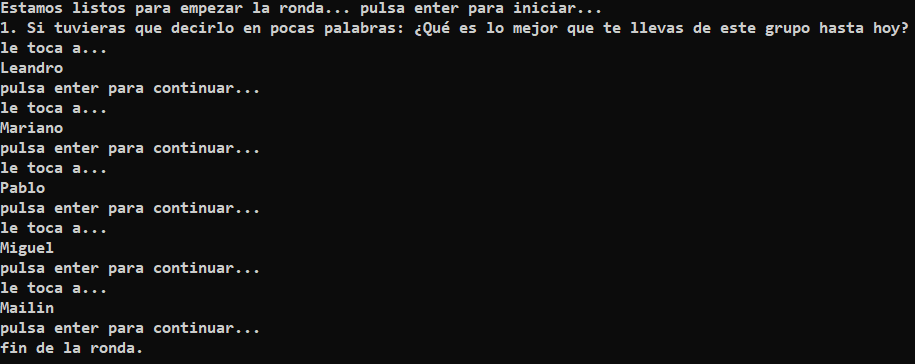

 A partir de las respuestas de cada integrante del grupo y la posterior conversación, decidimos tomar las siguientes acciones:

- Planificar con anticipación horario y fecha de las próximas ceremonias para una mejor organización
- Centrarnos en la calidad antes que cantidad (ser más realistas con las próximas planning y con los tiempos de cada uno)
- Armar subgrupos de trabajo
- Mantener la calidad de comunicación que el grupo mantuvo desde el principio

### Calidad

- No se realizaron acciones

## Sprint 7

**Scrum master:** Miguel Barraza

### Planning

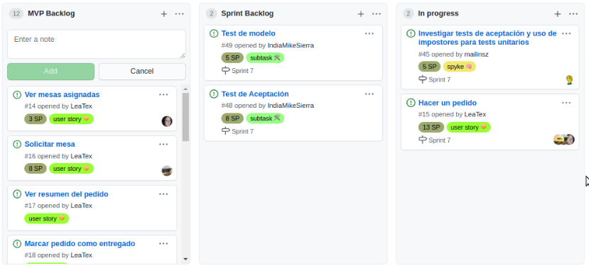

- Cantidad de story points comprometidos en el sprint: **31 SP**

### Daily

- A través de WhatsApp a diario.
- A través de Google Meet al menos 2 veces por semana.

### Refinamiento

- A partir de esta reunión surgió la necesidad de  crear 2 user stories nuevas enfocadas en mejorar la experiencia de usuario.
- Estas se agregaron al sprint actual

Como parte de la mejora ux: se define mejorar la estética de la barra de  menú del panel de control y agregar un acceso al login desde la página de inicio.

### Review

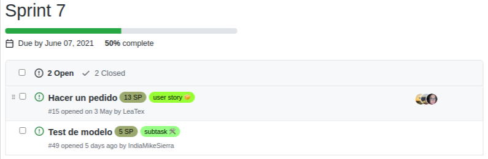

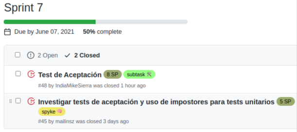

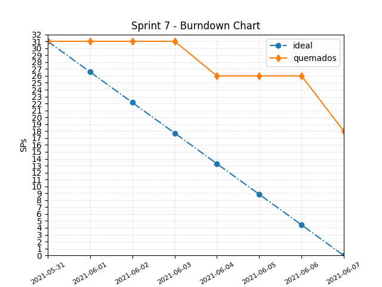

- Cantidad Story Points quemados: **13 SP**

### Retrospective

- Realizamos una actividad basada en 3 preguntas disparadoras para ver la visión personal de cada integrante del grupo y conversar luego sobre lo que surgió.
- Usamos un script de python para generar la ronda aleatoria e ir contestando las preguntas planteadas
- se presentó principal enfoque en poner los valores como persona y como equipo en la reunión.

Frases que surgieron de las preguntas de valores personal
- Esto  representa mi sueño, mi tiempo, mi esfuerzo
- No importa donde lo llevo, si no lo que está adentro.
- Mis alas para volar
- Mi forma de conectarme, tiene vinculos emocionales

importante
es bueno salirse de la zona técnica. porque siento que el resto de tu vida, no le importa  a nadie.

en la actividad seleccionamos una palabra que valoriza nuestro equipo:
- unión
- comprensión
- comunicación
- empatía
- acompañamiento

### Calidad

- Se implementó test de aceptación.
- Se implementó base de datos de testing.

## Sprint 8

**Scrum master:** Mariano Alvarez

### Planning

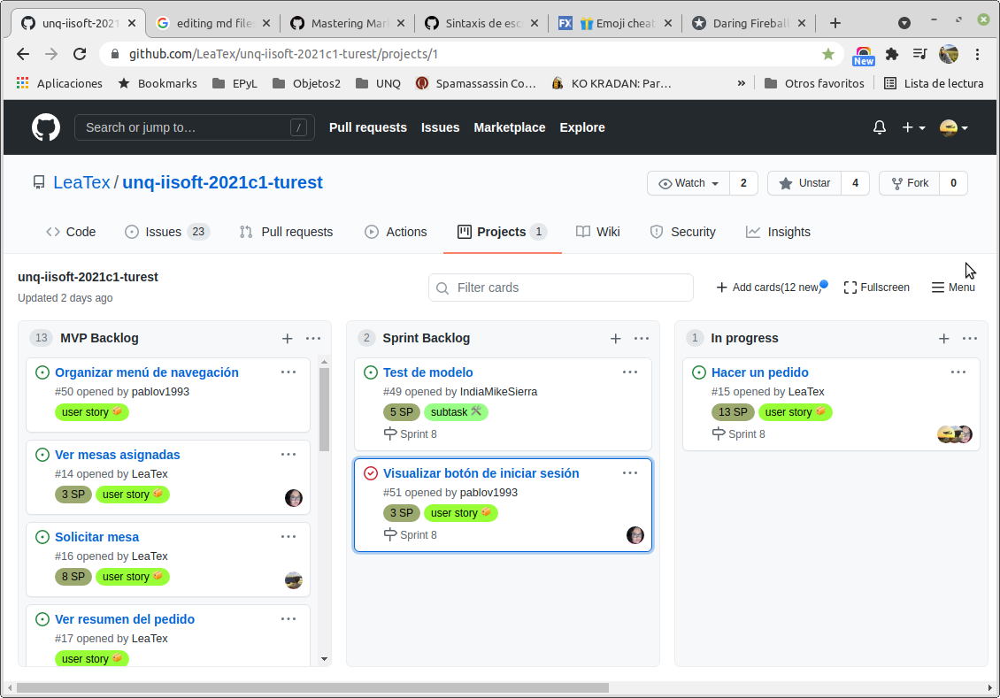

- Cantidad de story points comprometidos en el sprint: **21 SP**

### Daily

- A través de WhatsApp a diario.
- A través de Google Meet al menos 2 veces por semana.

### Refinamiento

- No se realizó.

### Review

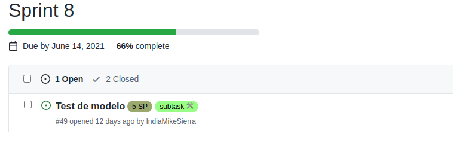

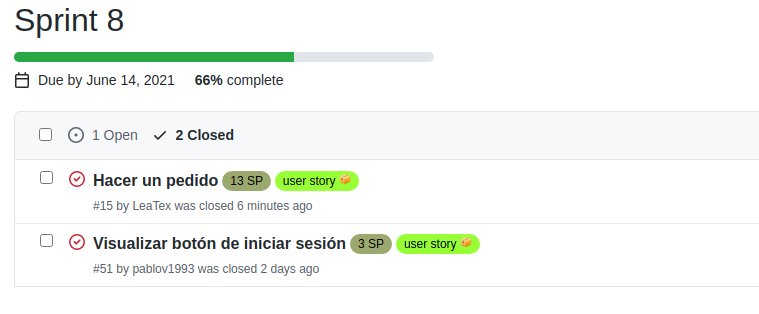

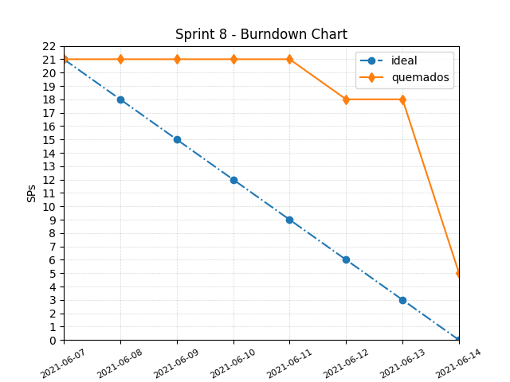

- Cantidad Story Points quemados: **16 SP**

### Retrospective

- Realizamos una actividad basada en 3 preguntas disparadoras, con el fin de para ver la visión personal de cada integrante del grupo y conversar luego sobre lo que surgió.
- Se utilizaron las herramientas web https://easyretro.io/ con el fin de explorar nuevas formas de realizar la ceremonia y la herramienta Google Meet https://meet.google.com/. Todos los integrantes del equipo iniciaron sesión y atendieron las consignas del Scrum Master
- Se presentaron enfoques para encontrar el mejor espacio de trabajo, entender que el valor de la comunicación, saber que el proyecto (cualquier sea) es llevado adelante por personas, que no sólo se compone de objetivos que cumplir, técnicas y herramientas a utilizar, estrategias de trabajo, etc.

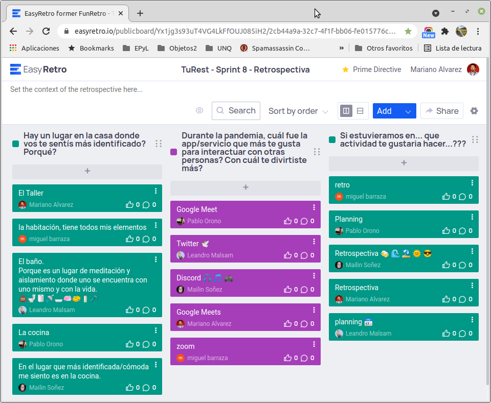

Frases que surgieron de la pregunta 1:

- Es el espacio donde:
-- Obtengo mi mejor versión
-- Me desconecto del resto de las cosas
-- Me siento con más confianza, me siento más seguro.
-- Paso obstáculos.
-- Me encuetro con los demás.

Frases que surgieron de la pregunta 2:

-La herramienta comunicacional:
-- Es sencilla
-- De uso diario.
-- Es accesible.
-- Es como estar en la presencialidad.

Frases que surgieron de la pregunta 3, utilizando la siguiente imágen como disparador:

En la actividad realizada, los conceptos valorizados por nuestro equipo fueron:
- Tener un espacio de comunicacion equilibrado donde los integrantes se sientan cómodos, redundando en mejorar las relaciones interpersonales, afectado positivamente al proyecto.
- La ceremonia preferida es la Retrospectiva.
- Utilizar nuevas herramientas para llevar adelante esta ceremonia.

### Calidad

- No se implementó

## Sprint 9

**Scrum master:** Pablo Oronó

### Planning

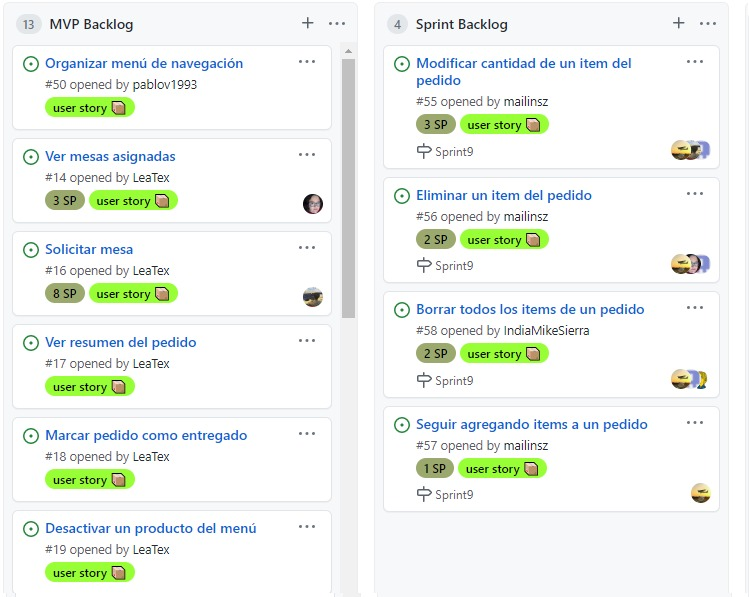

- Cantidad de story points comprometidos en el sprint: **8 SP**

### Daily

- A través de WhatsApp a diario.
- A través de Google Meet al menos 2 veces por semana.

### Refinamiento

- Se realizó antes de la planning
- Se identificó que modificar pedido es una Epica
- Se crearon las 4 US que arman la épica y se agregaron al backlog

### Review

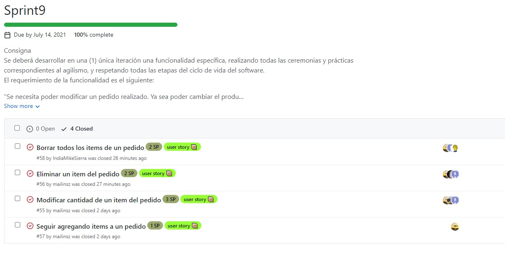

- Cantidad Story Points quemados: **8 SP**

### Retrospective

- Realizamos la actividad "Lo bueno, malo y feo"
- Se utilizaron las herramientas de google docs y meets

- Lo bueno:

- Lo malo:

- Lo feo:

- Puntos de mejora detectados: 

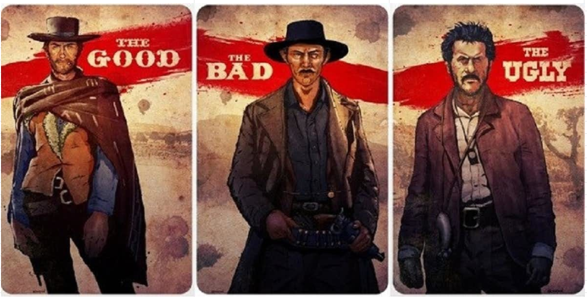

### Calidad

- Se implementó un test para la US  "eliminar item"
