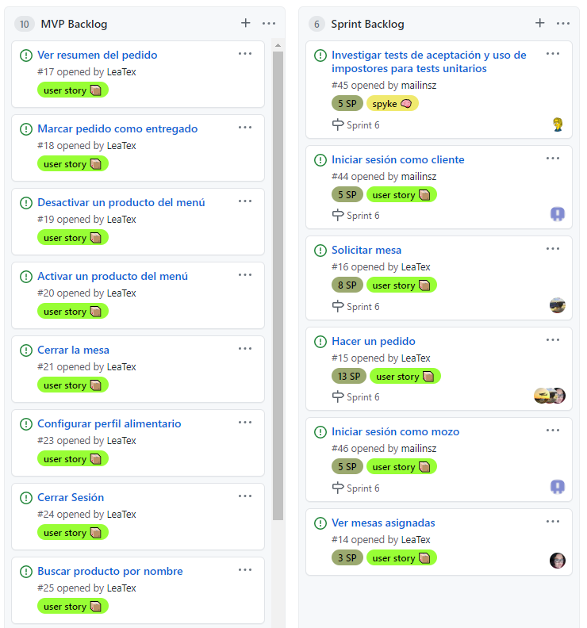

# TuRest

## Grupo nro 1

### Elevator's pitch

Para el administrador de un local de comida, quien necesita la gestión sistemática y brindar un servicio digital a sus clientes, TuRest es una app web que gestiona atención y experiencia del cliente para el nuevo contexto. A diferencia de otras aplicaciones gastronómicas, nuestro producto le dará fidelización de clientes, menúes accesibles para diversos comensales y autonomía en la gestión del servicio. Y en resumen una transformación digital.

<!-- TOC -->
[toc]
<!-- /TOC -->

## Sprint 0

En esta instancia deberán:

- Contar con el entorno instalado y configurado para todo el equipo
- Disponer de todas las herramientas necesarias para la gestión del proyecto.
- Entregar el link a un documento README con todos los links del proyecto. El mismo deberá contener:
  - Tablero con el Backlog general
  - Documento de reporte
  - Repositorio
  - Url del producto

## Sprint 1

En esta instancia deberán:

- Definir un MVP
- Entregar un storyMapping con las funcionalidades del MVP
- Armar el backlog del MVP en la herramienta elegida (y configurada en el sprint anterior)

## Sprint 2

**Scrum master:** Mariano Álvarez

### Planning

### Daily

- Si.
- 1 vez x semana.

### Refinamiento

No se realizaron accionesn de refinamiento.

### Review

Cantidad Story Points quemados: 0
No se realizaron tareas de desarrollo.

### Retrospective

No se realizó.

### Calidad

No se realizaron acciones.

## Sprint 3

**Scrum master:** Leandro Malsam

### Planning

- Cantidad de story points comprometidos en el sprint: **7 SP**

### Daily

- A través de WhatsApp a diario.
- A través de Google Meet al menos 2 veces por semana.

### Refinamiento

N/A

### Review

- Cantidad Story Points quemados: **7 SP**

### Retrospective

Sprints 1 a 3.

- Inicialmente se demoró la selección de las herramientas de gestión, pero una vez definidas, la organización mejoró notablemente.
- Falta de seniority en el uso de las tecnologías. Se deberá seguir investigando y capacitando al equipo.
- Las planificaciones no se realizaron al comienzo de cada sprint, sino con cierta demora, lo que implicó que sobre los días finales haya que apresurar las tareas aumentando la carga de trabajo. Se deberá realizar la planificación temprana al comienzo del sprint.

### Calidad

- No se realizaron acciones.

## Sprint 4

**Scrum master:** Pablo Oronó

### Planning

- Cantidad de story points comprometidos en el sprint: **11 SP**

### Daily

- A través de WhatsApp a diario.
- A través de Google Meet al menos 2 veces por semana.

### Refinamiento

N/A

### Review

- Cantidad Story Points quemados: **11 SP**

### Retrospective

Sprints 4.

- Con los ambientes correctamente instalados y las herramientas de trabajo definidas, trabajamos mucho mas fluidos en este Sprint
- Seguimos avanzando con el aprendizaje de las herramientas durante el sprint
- Las planificaciones fueron realizadas en el día 0 del Sprint y esto nos ayudo en nuestra organización. Vamos a seguir con esta dinamica
- Falta profundizar en tests. En sprint nro 5 vamos a realizar test para el back-end la US de "alta de mozo".

### Calidad

- No se realizaron acciones.

## Sprint 5

**Scrum master:** Mailin Soñez

### Planning

- Cantidad de story points comprometidos en el sprint: **19 SP**

### Daily

- A través de WhatsApp a diario.
- A través de Google Meet al menos 2 veces por semana.

### Refinamiento

- Se realizó antes de la planning
- A partir de esta reunión surgió la necesidad de  crear 3 user stories nuevas
- Estas se agregaron al sprint actual

### Review

- Cantidad Story Points quemados: **19 SP**

### Retrospective

- No se realizaron acciones.

### Calidad

- Se investigó sobre el uso de actions, tests y otras tareas para integración continua
- Configuramos Lint en nuestro proyecto

## Sprint 6

**Scrum master:** Mailin Soñez

### Planning

- Cantidad de story points comprometidos en el sprint: **39 SP**

### Daily

- A través de WhatsApp a diario.
- A través de Google Meet al menos 2 veces por semana.

### Refinamiento

- Se realizó antes de la planning
- A partir de esta reunión surgió la necesidad de  crear 2 user stories nuevas
- Estas se agregaron al sprint actual

### Review

- Cantidad Story Points quemados: **10 SP**

### Retrospective

- No se realizaron acciones.

### Calidad

- No se realizaron acciones